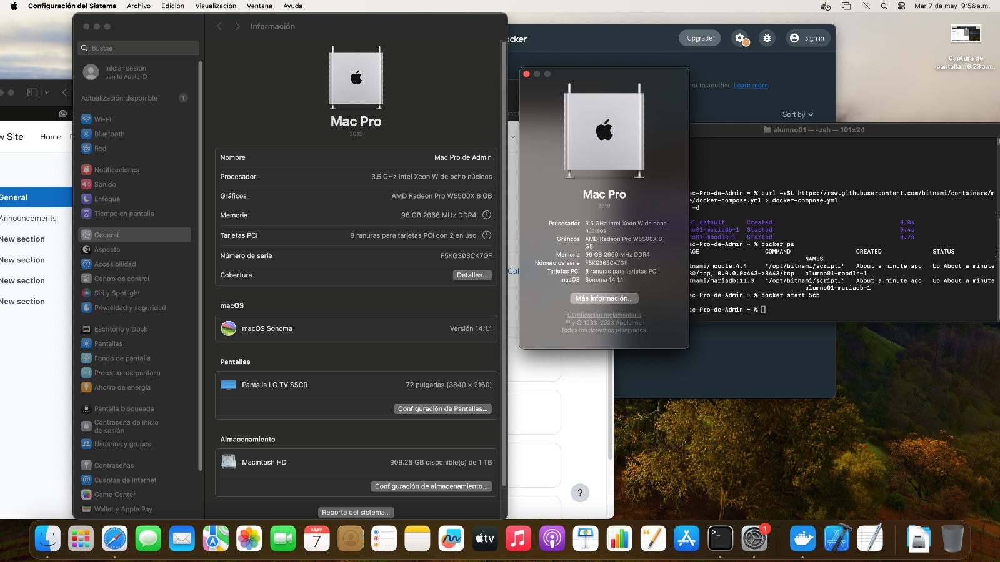

# MoodleExamenDevOps
## Test de montar un contenedor de moodle usando docker compose, como configurarlo y agregar usuarios con un curso.

Lo primero sera clonar el repositorio y el archivo .yml que nos proporciona la pagina de docker hub, se puede copiar y pegar en la terminal para hacer la instalacion
```
curl -sSL https://raw.githubusercontent.com/bitnami/containers/main/bitnami/moodle/docker-compose.yml > docker-compose.yml
docker compose up -d
```


Una vez clonado el repo lo debemos ver levantado usando el comando
```
docker ps -a
```
en dado caso que no este levantado lo podemos levantar con el comando
```
docker start "ID del contenedor"
```
Luego comprabamos que este levantado el servicio de moodle con docker entrando al navegador y poniendo la ip de nuestra maquina donde este montado docker poniendo primero https://myip
un ejemplo:
```
https://192.168.56.102
```
Para poder entrar como administrador al moodle se tiene el siguiente usuario administrador y contraseña predetermiandos

| user | password |
| ------ | ------ |
| admi | bitnami|

De esta manera ingresamos como administrador al moodle y podremos crear cursos, agregar usuarios, etc.


## Creacion de un Curso

Para poder crear un curso en moodle nos vamos al boton de arriba que dice "My courses"


Despues en ello nos dice si queremos crear un curso y entramos, posteriormente creamos un curso con los datos deseados.
En mi caso cree uno llamado "Curso1"


Una vez que el curso este creado podemos crear nuestros usuarios para agregarlos al curso.
Para crear usuarios nos vamos al boton de arriba a la izquierda "Site administration", una vez ahí nos vamos a "users" y "Add new user".
Una vez ahí podemos crerar un nuevo usuario, yo cree los usuarios javier, william, ruben y raul que son los principales para este ejemplo de practica.

Usuario Javier


Usuario William


Usuario Ruben


Usuario Raul


Una vez que hayamos creado a todos los usuarios podremos verlos en una lista en el apartado de "Browse list of users"


## Agregar usuarios a un curso
Para agregar usuarios a un curso es necesario ir al curso y de ahi entrar al apartado de "Participants" despues es darle al boton azul de "Enrol users" y nos dejara agregar a los participantes y darles un rol.


Como se puede ver en la primera opcion nos deja agregar a todos los usuarios deseados y en la parte de abajo darles un rol ya sea de estudiantes o maestros.

al final me quedo así.


Donde el usuario Javier, Ruben y Raul son estudiantes y el usuario William es el maestro.

Toda esta practica fue realizada con fines estudiantiles y realizadas en una Mac para poder llevarlo acabo.

## Datos de la Mac

1.- ¿Qué modelo de Mac?
```
Mac Pro 2019
```
2.-¿Cuánta memoria RAM tiene?
```
96 GB de ram DDR4 a 2666Mhz
```
3.- ¿Qué procesador tiene?
```
Intel Xeon W
```
4.- ¿Cuántos núcleos tiene?
```
8 nucleos
```
5.- ¿Cuántos hilos de ejecución tiene?
```
16 hilos
```
Captura de pantalla de las especificaciones de la Mac

